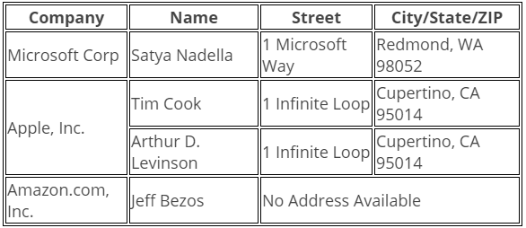

# Project Tutorial

Use HTML to create a table that tells you the Company, Name, Address, and City/State/ZIP of various people for the following companies.

## Example
|Company            | Name          | Address           | City/State/ZIP    |
|---                |---            |---                |---                |
| Microsoft Corp.   | Satya Nadella | 1 Microsoft Way   | Redmond, WA 98052 |
| Etc...            |               |                   |                   |

## Resources:

* [W3Schools HTML Reference: `<table>` tag](https://www.w3schools.com/tags/tag_table.asp)
* [W3Schools HTML Tables](https://www.w3schools.com/html/html_tables.asp)
* [W3Schools CSS Tables](https://www.w3schools.com/Css/css_table.asp)

## Data

Create a row for each person in the database.

* Microsoft Corp.
    * Satya Nadella
        * 1 Microsoft Way
        * Redmond, WA 98052
* Apple, Inc.
    * Tim Cook
        * 1 Infinite Loop
        * Cupertino, CA 95014
    * Arthur D. Levinson
        * 1 Infinite Loop
        * Cupertino, CA 95014
* Amazon.com, Inc.
    * Jeff Bezos
        * No Address Available

## Step-by-Step Instructions

1. Make the first row a table heading. Use `<th>` instead of `<tr>`
2. Input each person into the table.
3. Use a `rowspan` to span Apple, Inc. for Tim Cook and Arthur D. Levinson
4. Use a `colspan` to span "No Address Available" for the Address, City, State, and ZIP for Jeff Bezos.
5. Give your table a border. (Using CSS... NOT `border="1"`)

## Finished Table

## Hints

* After you create the first regular row, copy and paste it to save time creating the rest of the rows. (You will still have to delete `<td>`'s when you to the `rowspan` and `colspan`)
* Create your border right away! It will make the table easier to read. There is an empty CSS selector already written for you in `style.css`